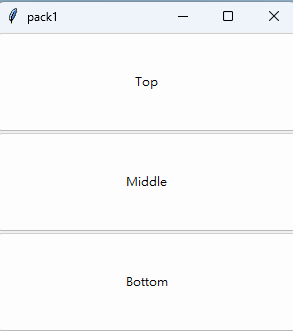
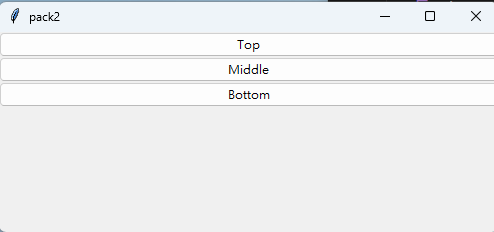
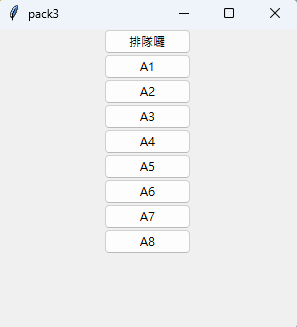

## HW(issue#112)
### 作業內容：請建立3個以上的tkinter的layout的主檔

## [hw01.py](https://github.com/joanna0511/joanna_window/blob/main/window_layout/index4.py)

## [hw02.py](https://github.com/joanna0511/joanna_window/blob/main/window_layout/index3.py)

## [hw03.py](https://github.com/joanna0511/joanna_window/blob/main/window_layout/index1.py)

