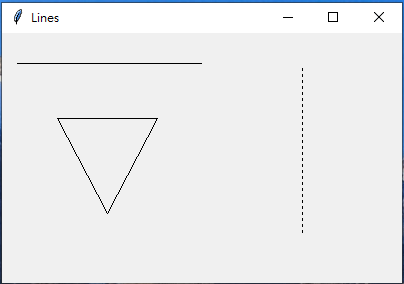
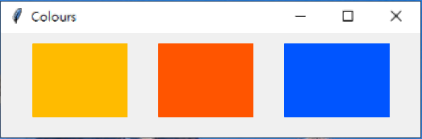
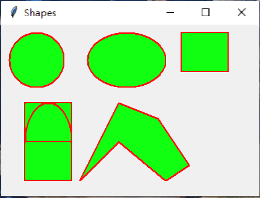
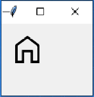
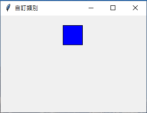

# 作業 issue#248

## 內容:請將pythonWindow內的繪圖部份,做一次 #248

## 畫線 

### [程式碼 line.py](https://github.com/joanna0511/joanna_window/blob/main/Homework/issue248/canvas.py)

### 

## 矩形(線框和填色)

### [程式碼 rectangle.py](https://github.com/joanna0511/joanna_window/blob/main/Homework/issue248/rectangle.py)

### 

## 不規則形狀,圓形,圓弧形

### [程式碼 irregular_shape.py](https://github.com/joanna0511/joanna_window/blob/main/Homework/issue248/irregular_shape.py)

### 

## 畫圖片

### [程式碼 draw_pic.py](https://github.com/joanna0511/joanna_window/blob/main/Homework/issue248/draw_pic.py)

### 

## 自訂Canvas類別

### [程式碼 customize.py](https://github.com/joanna0511/joanna_window/blob/main/Homework/issue248/customize.py)

### 