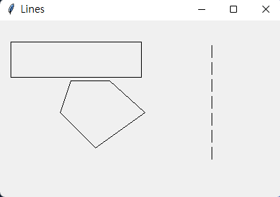
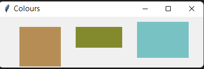
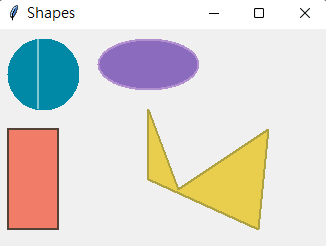
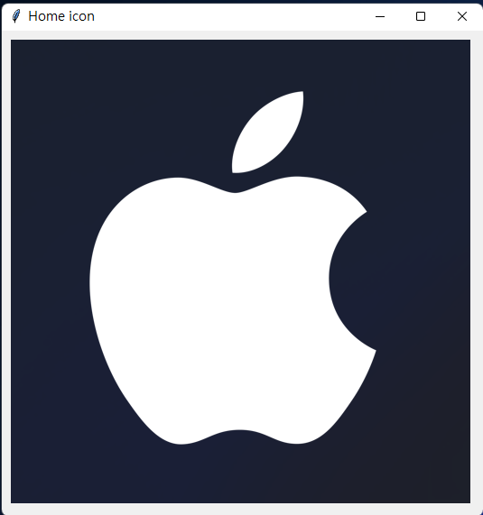
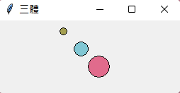

## 請將pythonWindow內的繪圖部份,做一次 #248

### [window01.py](https://github.com/Ian092/Ian_window/blob/main/homework/issue248/window01.py)

### [window02.py](https://github.com/Ian092/Ian_window/blob/main/homework/issue248/window02.py)

### [window03.py](https://github.com/Ian092/Ian_window/blob/main/homework/issue248/window03.py)

### [window04.py](https://github.com/Ian092/Ian_window/blob/main/homework/issue248/window04.py)

### [window05.py](https://github.com/Ian092/Ian_window/blob/main/homework/issue248/window05.py)

