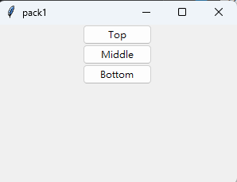
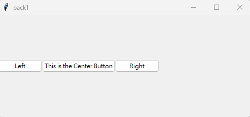
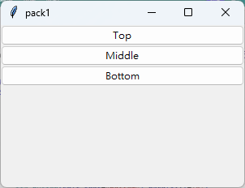
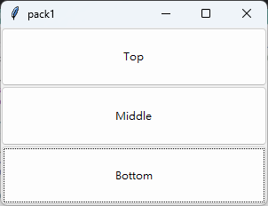
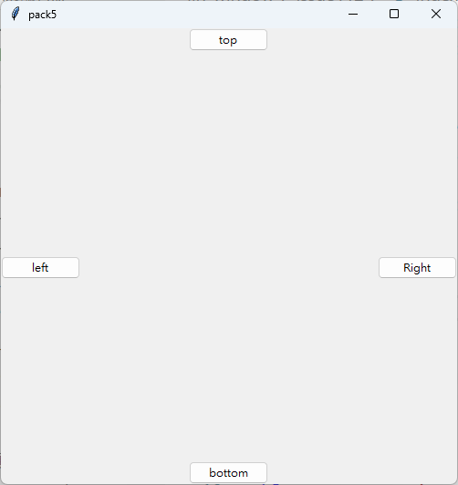
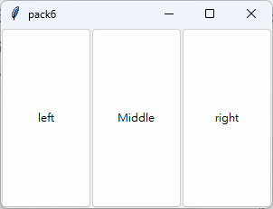
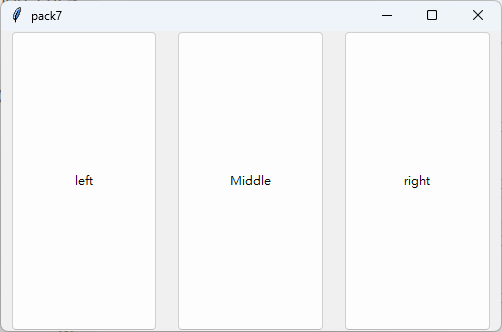

# Homework(issue#112)
### 作業內容：請建立3個以上的tkinter的layout的主檔

## [index1.py](https://github.com/mrlinyin2024/__11304_python_2024_tvdi__/blob/main/homework/%E6%9E%97%E4%BD%91%E7%A9%8E/issue112/index1.py)

## [index2.py](https://github.com/mrlinyin2024/__11304_python_2024_tvdi__/blob/main/homework/%E6%9E%97%E4%BD%91%E7%A9%8E/issue112/index2.py)

## [index3.py](https://github.com/mrlinyin2024/__11304_python_2024_tvdi__/blob/main/homework/%E6%9E%97%E4%BD%91%E7%A9%8E/issue112/index3.py)

## [index4.py](https://github.com/mrlinyin2024/__11304_python_2024_tvdi__/blob/main/homework/%E6%9E%97%E4%BD%91%E7%A9%8E/issue112/index4.py)

## [index5.py](https://github.com/mrlinyin2024/__11304_python_2024_tvdi__/blob/main/homework/%E6%9E%97%E4%BD%91%E7%A9%8E/issue112/index5.py)

## [index6.py](https://github.com/mrlinyin2024/__11304_python_2024_tvdi__/blob/main/homework/%E6%9E%97%E4%BD%91%E7%A9%8E/issue112/index6.py)

## [index7.py](https://github.com/mrlinyin2024/__11304_python_2024_tvdi__/blob/main/homework/%E6%9E%97%E4%BD%91%E7%A9%8E/issue112/index7.py)

