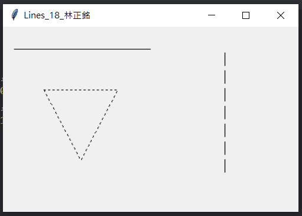
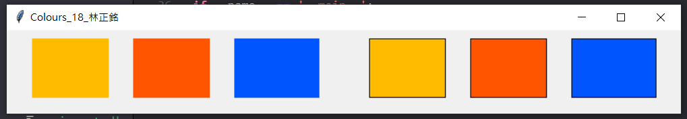
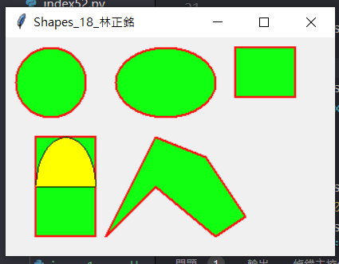
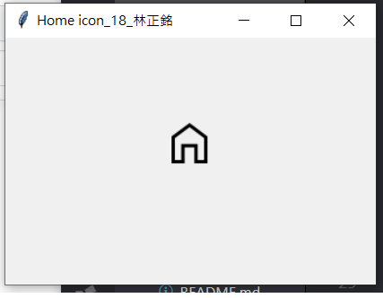
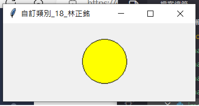

# issue248作業 (06/14) for 繪圖
## 18 林正銘

## [issue248作業1](./image1.py)
## [issue248作業2](./image2.py)
## [issue248作業3](./image3.py)
## [issue248作業4](./image4.py)
## [issue248作業5](./image5.py)

## [issue248作業1圖檔](./image1.png)

## [issue248作業2圖檔](./image2.png)

## [issue248作業3圖檔](./image3.png)

## [issue248作業4圖檔](./image4.png)

## [issue248作業5圖檔](./image5.png)

