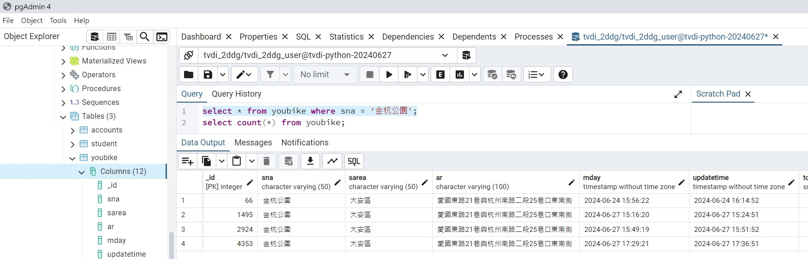

## 0627_作業18_林正銘_issue276

## 下載youbike的資料,進入postgreSQL的youbike的table (updatetime + sna的2個欄位的值不可以重覆)

#### 分析如何處理
#### UNIQUE(sna, updateTime) , for create table 
#### ON CONFLICT (sna, updateTime) DO NOTHING , for insert table

# 但是有問題
### 可以 insert 入 table (youbike) , 但是 無法 ON CONFLICT 成功執行
### 也就是說 insert 加入 ON CONFLICT 就產生語法錯誤 , 等待問老師來解決 ...

## [程式碼1連接](./index.py)
## [程式碼2連接](./ubikedata.py)

### postgreSQL
   