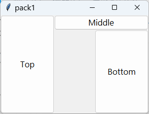
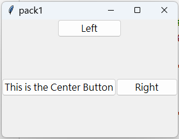

## HW(issue#112)20240528作業
作業內容:  
[請建立3個以上的tkinter的layout的主檔 #112](https://github.com/roberthsu2003/__11304_python_2024_tvdi__/issues/112)

### [index1.py 連結](https://github.com/kalmiavicky/__11304_python_2024_tvdi__/blob/main/homework/%E6%9E%97%E9%83%81%E9%9B%AF/issue112/index1.py)

### [index2.py 連結](https://github.com/kalmiavicky/__11304_python_2024_tvdi__/blob/main/homework/%E6%9E%97%E9%83%81%E9%9B%AF/issue112/index2.py)
)

### [index3.py 連結](https://github.com/kalmiavicky/__11304_python_2024_tvdi__/blob/main/homework/%E6%9E%97%E9%83%81%E9%9B%AF/issue112/index3.py)
)

