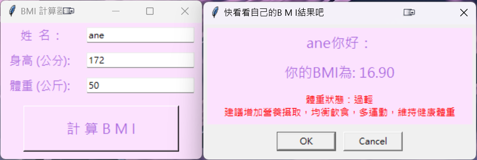
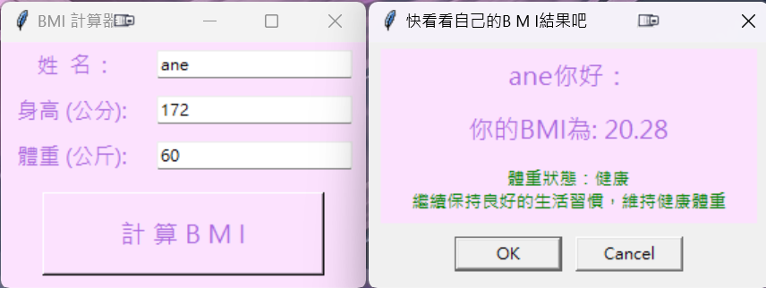
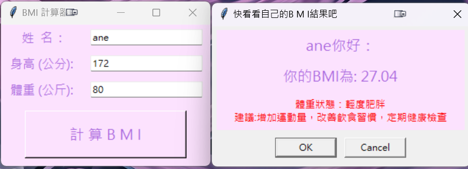
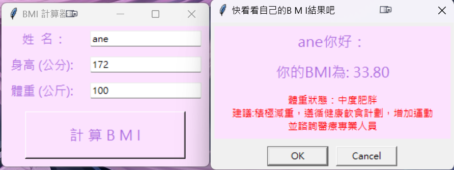
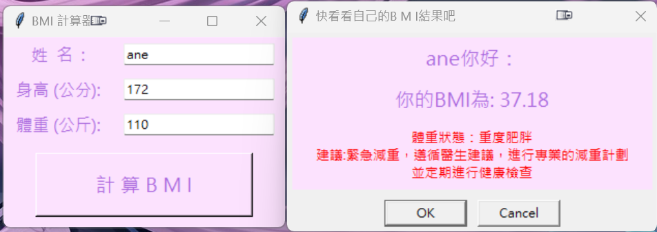

## HW(issue#216)20240606作業
作業內容:  
[請建立bmi計窗應用程式 #216](https://github.com/roberthsu2003/__11304_python_2024_tvdi__/issues/216)

[issue216 程式連結](https://github.com/kalmiavicky/vicky_window/blob/main/homework/issue216/index.py)

