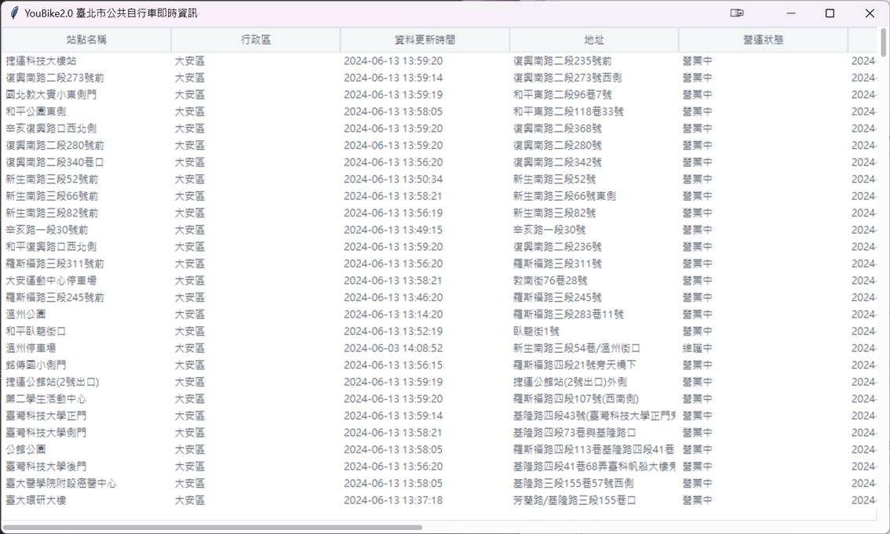

## HW(issue#235)20240611作業
作業內容:  
[請將下載的youbike及時資料,使用ttk.treeview顯示在視窗內 #235](https://github.com/roberthsu2003/__11304_python_2024_tvdi__/issues/235)

[data 程式連結](https://github.com/kalmiavicky/__11304_python_2024_tvdi__/blob/main/homework/%E6%9E%97%E9%83%81%E9%9B%AF/issue235/data.py)
[issue235 程式連結](https://github.com/kalmiavicky/__11304_python_2024_tvdi__/blob/main/homework/%E6%9E%97%E9%83%81%E9%9B%AF/issue235/index.py)
