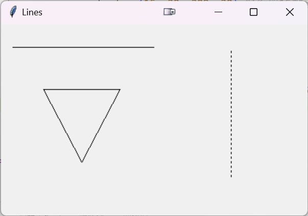
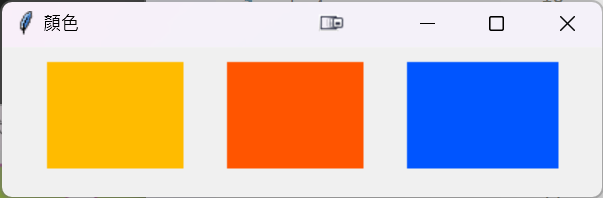
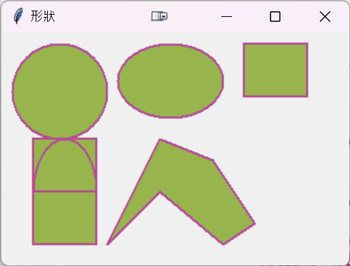
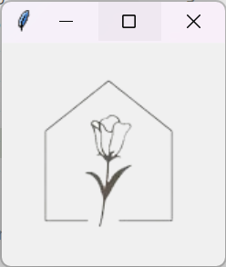
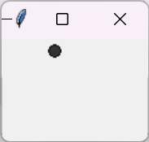

## HW(issue#248)20240614作業
作業內容:  
[請將pythonWindow內的繪圖部份,做一次 #248](https://github.com/roberthsu2003/__11304_python_2024_tvdi__/issues/248)

### [畫線 程式連結](https://github.com/kalmiavicky/__11304_python_2024_tvdi__/blob/main/homework/%E6%9E%97%E9%83%81%E9%9B%AF/issue248/index0.py)
   

 
### [矩形(線框和填色) 程式連結](https://github.com/kalmiavicky/__11304_python_2024_tvdi__/blob/main/homework/%E6%9E%97%E9%83%81%E9%9B%AF/issue248/index1.py)
       

  
### [不規則形狀,圓形,圓弧形 程式連結](https://github.com/kalmiavicky/__11304_python_2024_tvdi__/blob/main/homework/%E6%9E%97%E9%83%81%E9%9B%AF/issue248/index2.py)  
  

### [畫圖片](https://github.com/kalmiavicky/__11304_python_2024_tvdi__/blob/main/homework/%E6%9E%97%E9%83%81%E9%9B%AF/issue248/index3.py) 
       

  
### [自訂Canvas類別](https://github.com/kalmiavicky/__11304_python_2024_tvdi__/blob/main/homework/%E6%9E%97%E9%83%81%E9%9B%AF/issue248/index4.py)   
    

