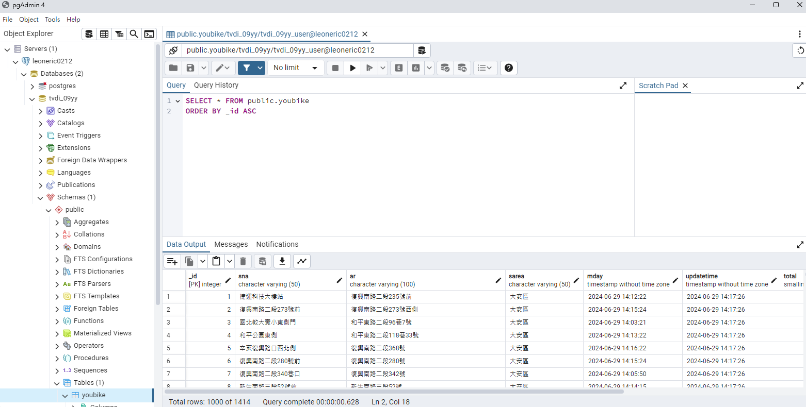

## issue276
### 下載youbike的資料,進入postgreSQL的youbike的table
### updatetime + sna的2個欄位的值不可以重覆

建立資料表時，將(sna,updatetime)設定unique建立條件約束，並可以將此條件約束命名  
在insert資料時，使用on conflict時do nothing來停止寫入該欄位；或是do update進行全部覆蓋，但是要寫的東西較多較麻煩

## [程式連結](./issue276.py)
pgAdmin畫面
## 