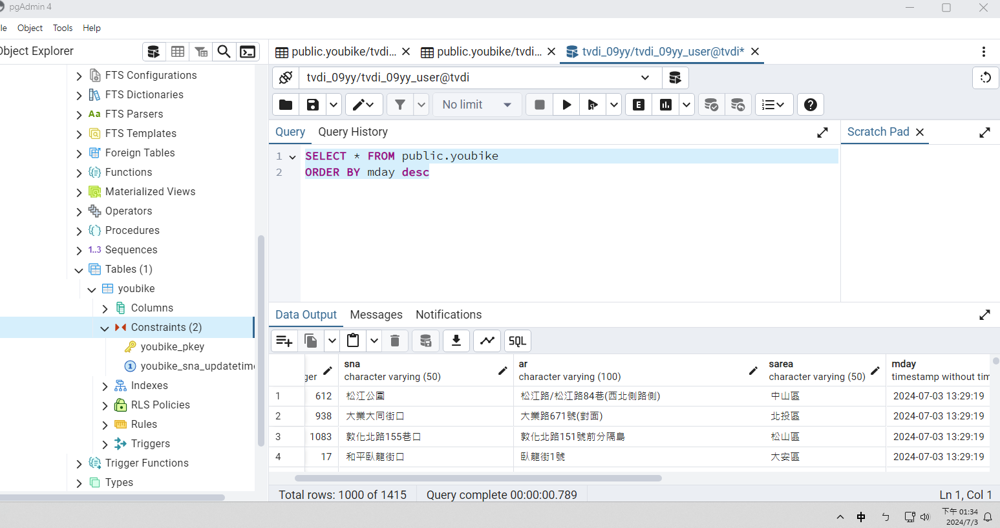
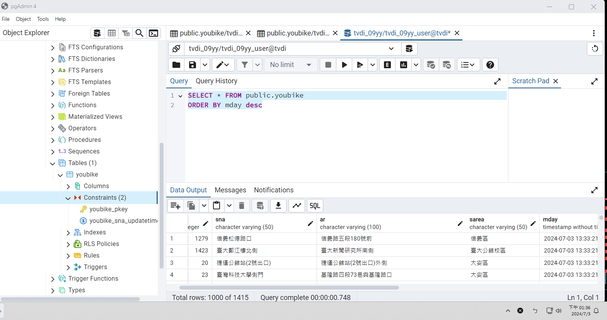

## issue293
### 請取出youbike表格內,所有站點的最新資料

利用UPDATE功能，條列每一個要更新的欄位，變數用%s  
利用WHERE和AND設定更新條件為"當新的資料中sna相同但updatetime不同，進行資料更新"  
再依序填入要更新的各欄位資料，且填入資料要包含條件欄位的資料  
即可在不更動TABLE的情況下，更新站點資料，且維持1415筆

## [站點資料更新程式](./issue293.py)
pgAdmin畫面  
資料更新前  

資料更新後  
