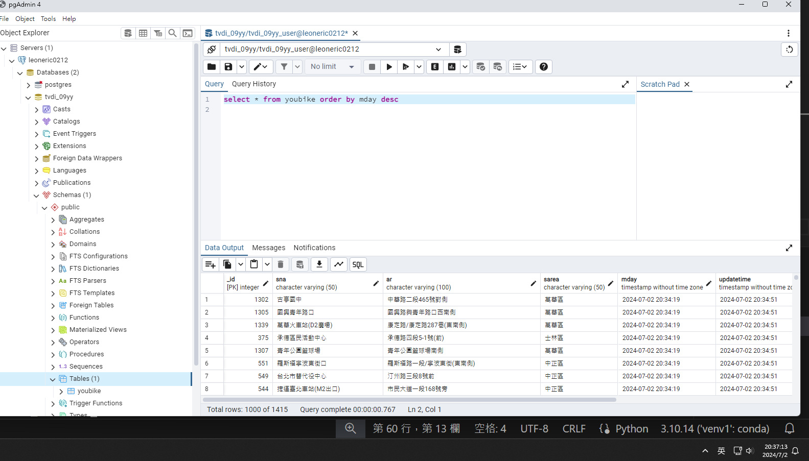

## issue293
### 請取出youbike表格內,所有站點的最新資料

建立資料表時，將sna設定unique建立條件約束  
在insert資料時，新增的暫時資料表為excluded，使用set來設定每個欄位更新的資料內容  
設定sna在on conflict時do update進行資料更新，同時在後面加上  
where youbike.updatetime != excluded.updatetime()  
來確保*新的資料時間*不同於*舊的資料時間*(但是若資料時間並非持續更新到最新，就會有可能存取的資料不是最新的)

## [程式連結](./issue293.py)
pgAdmin畫面
## 