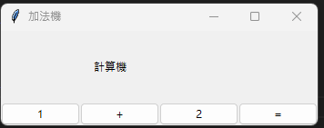
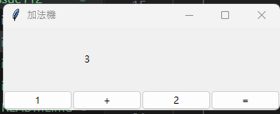
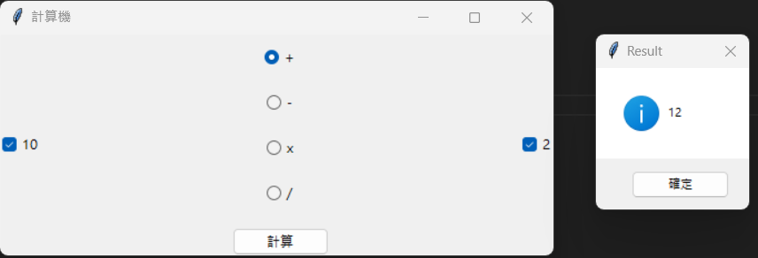
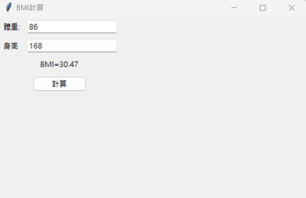

# issue112
>[參考網址1](https://github.com/roberthsu2003/pythonWindow/tree/master/%E5%88%9D%E8%A6%8Btkinter)
>[參考網址2](https://github.com/roberthsu2003/pythonWindow/tree/master/%E7%89%88%E9%9D%A2)
## index1.py
[layout1_code](index1.py)

---

## index2.py
[layout2_code](index2.py)

---

## index3.py
[layout3_code](index3.py)

---
