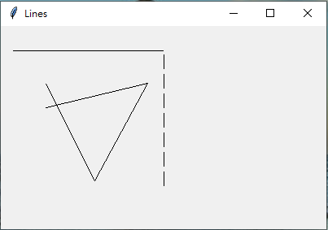
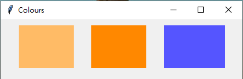
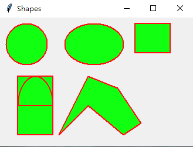
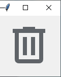
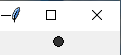

## issue248. 請將pythonWindow內的繪圖部份,做一次

# Canvas

## 1. 畫線

[程式碼](https://github.com/TedTian0502/Ted_window/blob/main/%E9%A1%9E%E5%88%A5/HW/issue248/drawline.py)

---

## 2. 矩形(線框和填色)

[程式碼](https://github.com/TedTian0502/Ted_window/blob/main/%E9%A1%9E%E5%88%A5/HW/issue248/color.py)

---

## 3. 不規則形狀,圓形,圓弧形

[程式碼](https://github.com/TedTian0502/Ted_window/blob/main/%E9%A1%9E%E5%88%A5/HW/issue248/geometric.py)

---

## 4. 畫圖片

[程式碼](https://github.com/TedTian0502/Ted_window/blob/main/%E9%A1%9E%E5%88%A5/HW/issue248/images.py)

---

## 5. 自訂Canvas類別

[程式碼](https://github.com/TedTian0502/Ted_window/blob/main/%E9%A1%9E%E5%88%A5/HW/issue248/inheritance.py)

