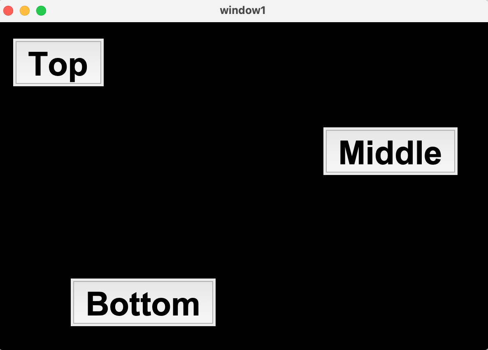
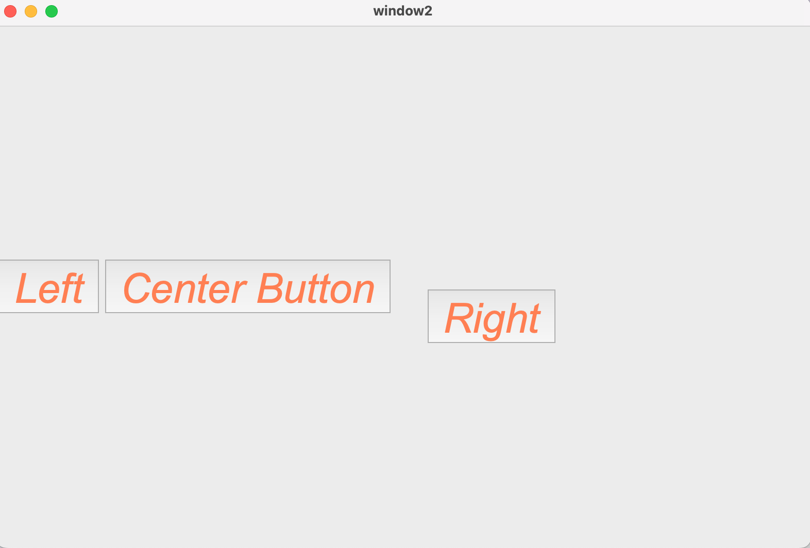
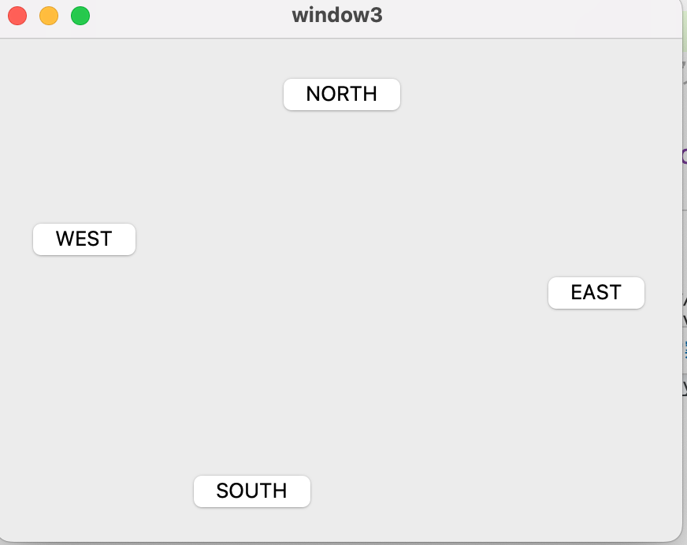

# 請建立3個以上的tkinter的layout的主檔 #112

# index1

## 程式碼

## [**index1.py**](index1.py)

## 網頁

# index2

## 程式碼

## [**index2.py**](index2.py)

## 網頁

# index3

## 程式碼

## [**index3.py**](index3.py)

## 網頁

