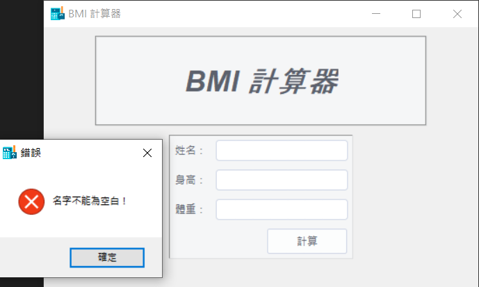
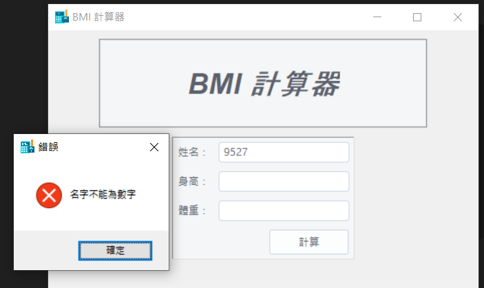
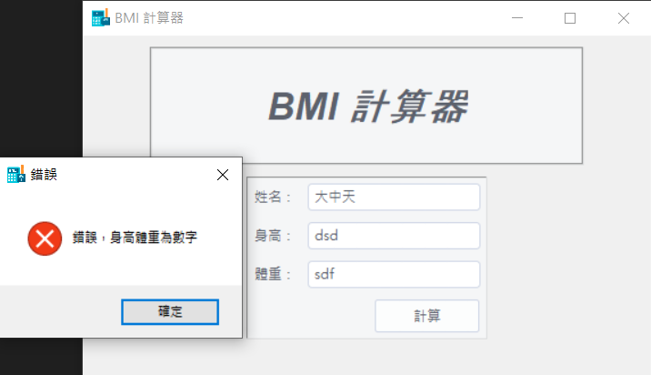
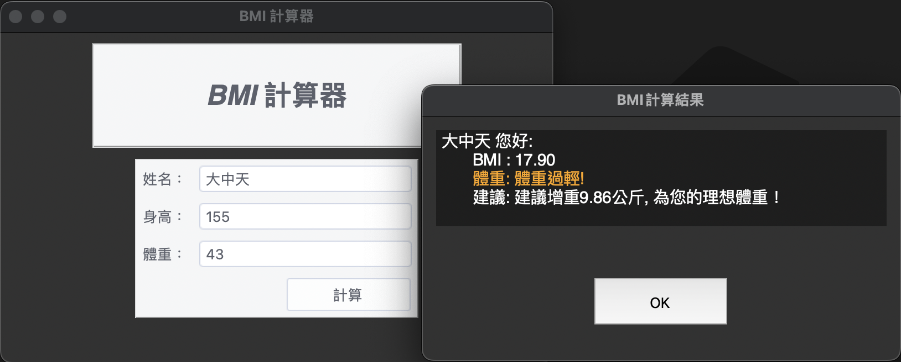
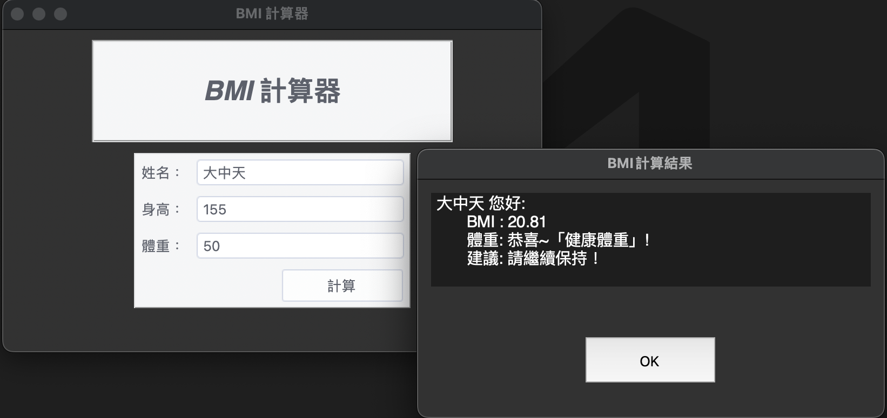
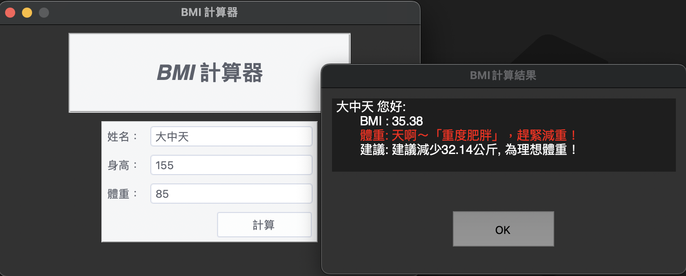

# 0606_作業7_issue216

## 請建立BMI計窗應用程式

## [程式碼連接](./index.py)

### 跳錯誤訊息: 名字不能為空白

---

### 跳錯誤訊息: 名字不能為數字

---

### 跳錯誤訊息: 身高和體重為數字

---

### 體重過輕, 顯示橘色字

---

### 體重正常, 顏色不變

---

### 體重過重, 顯示紅色字
