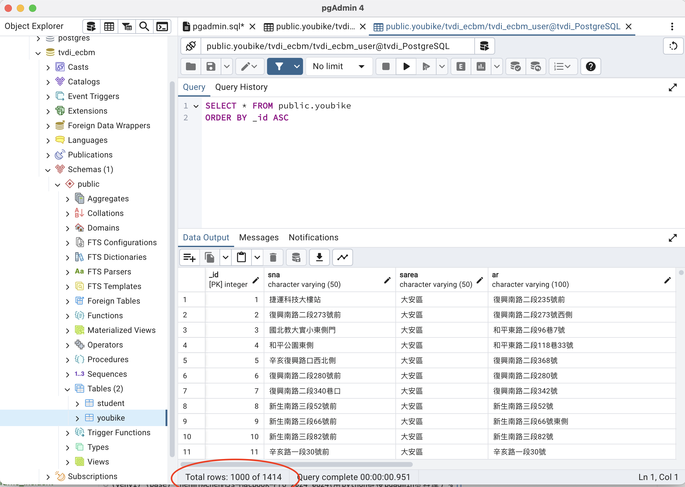

## Issue 276
### 下載youbike的資料,進入postgreSQL的youbike的table
### UNIQUE Constraint: Ensures that the values in one or more columns are unique across all rows in the table.
### ON CONFLICT DO NOTHING: Handles conflicts that arise from violating a unique constraint by instructing PostgreSQL to take no action (do nothing) and not raise an error.
### [sourcecode](下午.py)
### 