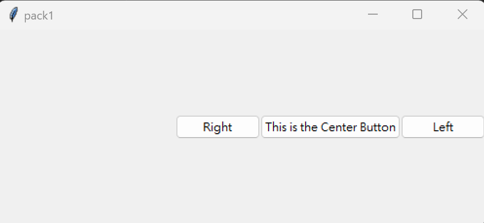
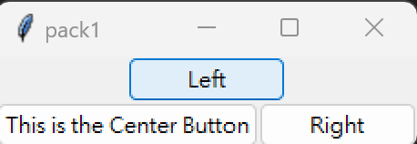
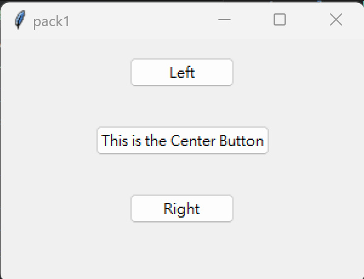

<<<<<<< HEAD
# index.py

## 作業內容：請建立3個以上的tkinter的layout的主檔

### [index1.py](https://github.com/NoktoX/__11304_python_2024_tvdi__/blob/main/homework/%E9%99%B3%E8%90%B1/issue112/index1.py)
```python
import tkinter as tk
from tkinter import ttk

class Window(tk.Tk):
    def __init__(self,**kwargs):
        super().__init__(**kwargs)
        self.title("pack1")
        self.geometry('500x200')
        
        ttk.Button(self,text="Left").pack(side='right')  

        ttk.Button(self,text="This is the Center Button").pack(side='right')  

        ttk.Button(self,text="Right").pack(side='right')
        


if __name__ == '__main__':
    window:Window = Window()
    window.mainloop()
```


### [index2.py](https://github.com/NoktoX/__11304_python_2024_tvdi__/blob/main/homework/%E9%99%B3%E8%90%B1/issue112/index2.py)
```python
import tkinter as tk
from tkinter import ttk

class Window(tk.Tk):
    def __init__(self,**kwargs):
        super().__init__(**kwargs)
        self.title("pack1")
        # self.geometry('500x200')
        
        ttk.Button(self,text="Left").pack(side='top')  

        ttk.Button(self,text="This is the Center Button").pack(side='left')  

        ttk.Button(self,text="Right").pack(side='left')
        


if __name__ == '__main__':
    window:Window = Window()
    window.mainloop()
```


### [index3.py](https://github.com/NoktoX/__11304_python_2024_tvdi__/blob/main/homework/%E9%99%B3%E8%90%B1/issue112/index3.py)
```python 
import tkinter as tk
from tkinter import ttk

class Window(tk.Tk):
    def __init__(self):
        super().__init__()
        self.title("pack1")
        self.geometry('300x200')
        
        fm = ttk.Frame(self)
        ttk.Button(self,text="Left").pack(side='top',expand='YES')  

        ttk.Button(self,text="This is the Center Button").pack(side='top',expand='YES')  

        ttk.Button(self,text="Right").pack(side='top',expand='YES')

        fm.pack(fill='both',expand='YES')


if __name__ == '__main__':
    window:Window = Window()
    window.mainloop()
```

=======
# index.py

## 作業內容：請建立3個以上的tkinter的layout的主檔

## [index1.py](https://github.com/NoktoX/__11304_python_2024_tvdi__/blob/main/homework/%E9%99%B3%E8%90%B1/issue112/index1.py)
```python
import tkinter as tk
from tkinter import ttk

class Window(tk.Tk):
    def __init__(self,**kwargs):
        super().__init__(**kwargs)
        self.title("pack1")
        self.geometry('500x200')
        
        ttk.Button(self,text="Left").pack(side='right')  

        ttk.Button(self,text="This is the Center Button").pack(side='right')  

        ttk.Button(self,text="Right").pack(side='right')
        


if __name__ == '__main__':
    window:Window = Window()
    window.mainloop()
```


## [index2.py](https://github.com/NoktoX/__11304_python_2024_tvdi__/blob/main/homework/%E9%99%B3%E8%90%B1/issue112/index2.py)
```python
import tkinter as tk
from tkinter import ttk

class Window(tk.Tk):
    def __init__(self,**kwargs):
        super().__init__(**kwargs)
        self.title("pack1")
        # self.geometry('500x200')
        
        ttk.Button(self,text="Left").pack(side='top')  

        ttk.Button(self,text="This is the Center Button").pack(side='left')  

        ttk.Button(self,text="Right").pack(side='left')
        


if __name__ == '__main__':
    window:Window = Window()
    window.mainloop()
```


## [index3.py](https://github.com/NoktoX/__11304_python_2024_tvdi__/blob/main/homework/%E9%99%B3%E8%90%B1/issue112/index3.py)
```python 
import tkinter as tk
from tkinter import ttk

class Window(tk.Tk):
    def __init__(self):
        super().__init__()
        self.title("pack1")
        self.geometry('300x200')
        
        fm = ttk.Frame(self)
        ttk.Button(self,text="Left").pack(side='top',expand='YES')  

        ttk.Button(self,text="This is the Center Button").pack(side='top',expand='YES')  

        ttk.Button(self,text="Right").pack(side='top',expand='YES')

        fm.pack(fill='both',expand='YES')


if __name__ == '__main__':
    window:Window = Window()
    window.mainloop()
```

>>>>>>> b0625e4d22d37b1466bb995972dac1ddd402c43e
