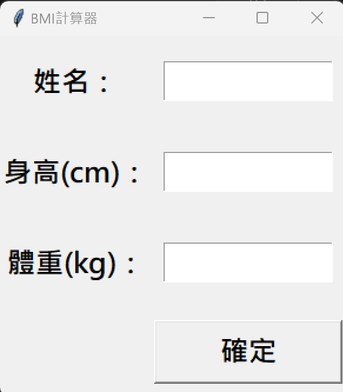
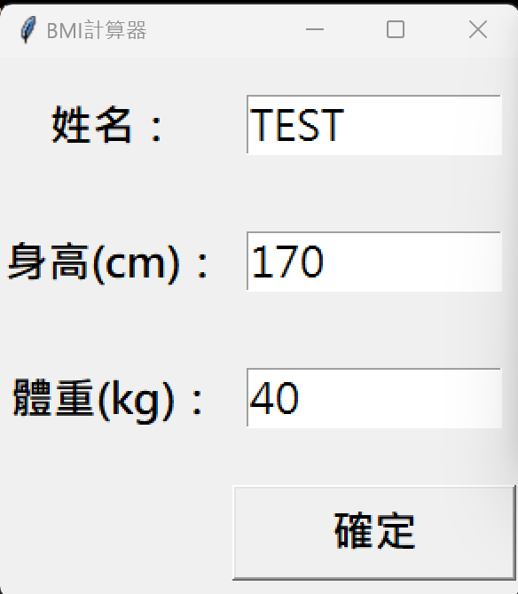
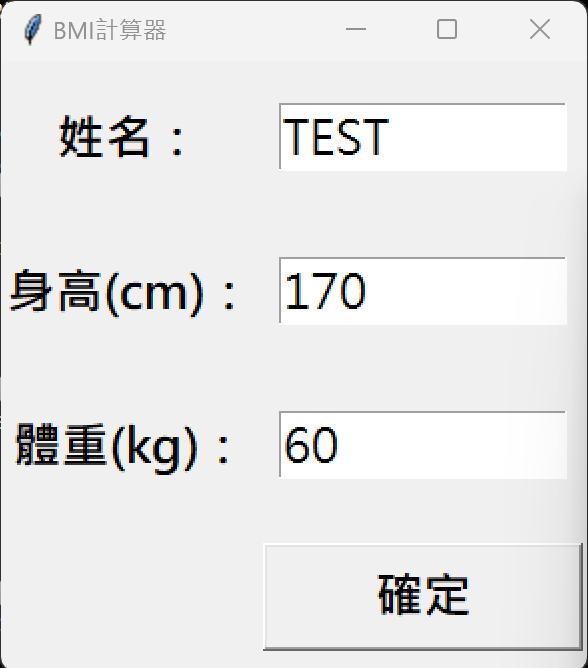

## BMI 作業 issue#192

[HW_issue192 連結](./BMI.py)


```python
import tkinter as tk
import tkinter.messagebox as messagebox
from tkinter.simpledialog import Dialog
from ttkthemes import ThemedTk

class Window(tk.Tk):
    def __init__(self):
        super().__init__()

        self.title('BMI計算器')
        
        self.name_label=tk.Label(self,text="姓名：",font=('微軟正黑體',18,'bold'))      
        self.name_label.grid(row=0,sticky=tk.N,pady=20)                               
        self.name_entry=tk.Entry(self,font=('微軟正黑體',18),width=10)                     
        self.name_entry.grid(row=0,column=1,sticky=tk.W,padx=10)                      

        self.height_label=tk.Label(self,text="身高(cm)：",font=('微軟正黑體',18,'bold'))
        self.height_label.grid(row=1,sticky=tk.N,pady=20)
        self.height_entry=tk.Entry(self,font=('微軟正黑體',18),width=10)
        self.height_entry.grid(row=1,column=1,sticky=tk.W,padx=10)

        self.weight_label=tk.Label(self,text="體重(kg)：",font=('微軟正黑體',18,'bold'))
        self.weight_label.grid(row=2,sticky=tk.N,pady=20)
        self.weight_entry=tk.Entry(self,font=('微軟正黑體',18),width=10)
        self.weight_entry.grid(row=2,column=1,sticky=tk.W,padx=10)

        self.submit = tk.Button(self, text="確定", font=('微軟正黑體', 18, 'bold'), command=self.get_BMI,width=10)  
        self.submit.grid(row=3,column=1, pady=10)                                                                  

    def get_BMI(self):        
        try:                  
            NAME=self.name_entry.get()
            HEIGHT=float(self.height_entry.get())
            WEIGHT=float(self.weight_entry.get())
            if HEIGHT=="" or HEIGHT<=0 or HEIGHT==False:
                messagebox.showerror("錯誤","請重新輸入身高")
                return
            elif WEIGHT=="" or WEIGHT<=0 or WEIGHT==False:
                messagebox.showerror("錯誤","請重新輸入體重")
                return
        except Exception:
            messagebox.showerror("錯誤","請輸入數字")
            return
        Result(parent=self,name=NAME,height=HEIGHT,weight=WEIGHT)

class Result(Dialog):         
    def __init__(self,parent,name:str="",height:float="",weight:float=""):
        self.name=name
        self.height=height
        self.weight=weight
        super().__init__(parent)

    def body(self,master):
        self.title(f"{self.name}您好：")
        BMI=self.weight/((self.height/100)**2)
        tk.Label(master,text=f"BMI：{BMI:.1f}",font=('微軟正黑體',18,'bold')).grid(row=0,pady=10,sticky=tk.W)
        if BMI<18.5 :
            tk.Label(master,text=f"體重：體重過輕",font=('微軟正黑體',18,'bold'),fg="red").grid(row=1, pady=10,sticky=tk.W)
            tk.Label(master,text=f"建議：再增重{(18.5-BMI)*((self.height/100)**2):.1f}公斤，可以達正常範圍",font=('微軟正黑體',18,'bold')).grid(row=2, pady=10,sticky=tk.W)
        elif BMI >=24:
            tk.Label(master,text=f"體重：體重過重",font=('微軟正黑體',18,'bold'),fg="red").grid(row=1, pady=10,sticky=tk.W)
            tk.Label(master,text=f"建議：再減少{(BMI-24)*((self.height/100)**2):.1f}公斤，可以達正常範圍",font=('微軟正黑體',18,'bold')).grid(row=2, pady=10,sticky=tk.W)
        else:
            tk.Label(master,text=f"體重：正常",font=('微軟正黑體',18,'bold')).grid(row=1, pady=10,sticky=tk.W)
            tk.Label(master,text="建議：繼續保持",font=('微軟正黑體',18,'bold')).grid(row=2, pady=10,sticky=tk.W)   


ALL = Window()
ALL.mainloop()
```








