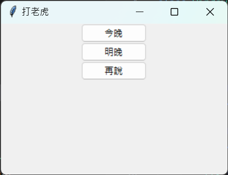
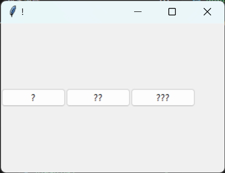
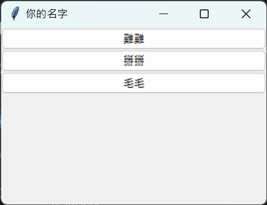
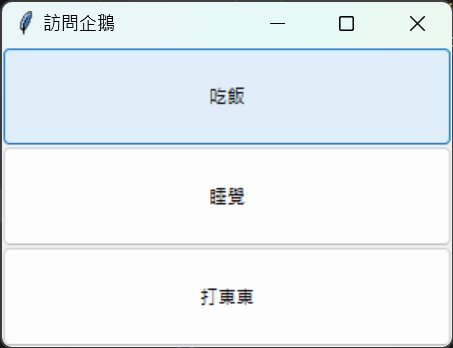

> 請建立3個以上的tkinter的layout的主檔

## index1.py

[程式1](https://github.com/LanvisWei/lanvis_window/blob/main/homework/issue112/index1.py)
---

## index2.py

[程式2](https://github.com/LanvisWei/lanvis_window/blob/main/homework/issue112/index2.py)

---

## index3.py

[程式3](https://github.com/LanvisWei/lanvis_window/blob/main/homework/issue112/index3.py)

---

## index4.py

[程式4](https://github.com/LanvisWei/lanvis_window/blob/main/homework/issue112/index4.py)